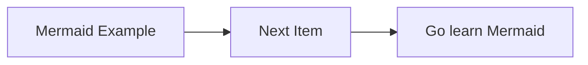
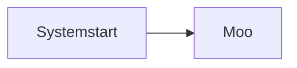
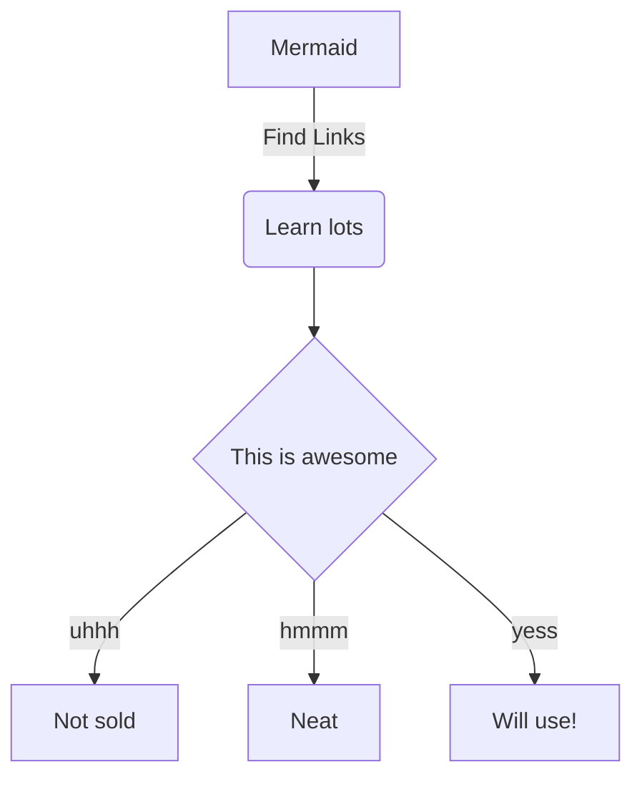

## Code Block Examples

Simple Mermaid





Decision Tree



Grabbed some code fromt he Gatsby docs...

```javascript{numberLines: false}
exports.onCreateWebpackConfig = ({
  stage,
  rules,
  loaders,
  plugins,
  actions,
}) => {
  actions.setWebpackConfig({
    module: {
      rules: [
        {
          test: /\.less$/,
          use: [
            // We don't need to add the matching ExtractText plugin
            // because gatsby already includes it and makes sure its only
            // run at the appropriate stages, e.g. not in development
            loaders.miniCssExtract(),
            loaders.css({ importLoaders: 1 }),
            // the postcss loader comes with some nice defaults
            // including autoprefixer for our configured browsers
            loaders.postcss(),
            `less-loader`,
          ],
        },
      ],
    },
    plugins: [
      plugins.define({
        __DEVELOPMENT__: stage === `develop` || stage === `develop-html`,
      }),
    ],
  })
}
```