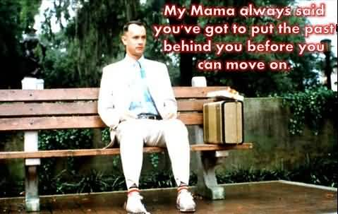

  

I have mastered the art of the re-start. Everytime I've restarted it usually meant restart everything. I've lost a whole bunch of content over the years. I've also discovered much by looking through old CDs or scraping the Way Back Machine. Once I found the content I hoarded it. It just simply got reinjected into my site without scrutiny. 

I ended up with much content I did not like, but felt obligated to honor the younger me. Okay, that's a lie. I ended up with a bunch of content that is not reflective of whom I've become - sacrificing my integrity just so that I can fill pages.

**No more I say!** I am keeping some old content in my repo, but I am no longer sharing it overtly. It does serve the purpose of new ideas or the opportunity for some rework and discovery. A decade ago, I blew all my content into smithereens. I made a mistake. That said, I prefer that than simply sharing things I clearly don't associate well with anymore.

My encouragement to myself: If it doesn't make sense, get rid of it!
