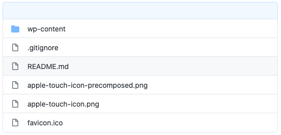

The following repo structure have worked really well for me:

  

Inside `.gitignore` I use the [template as provided by WP Engine](https://wpengine.com/wp-content/uploads/2020/02/recommended-gitignore-no-wp.txt) as a starting point with some minor modifications. [Here is my gist](https://gist.github.com/rheinardkorf/f053202364fe98ea3f27312d398d09ca).

Assuming you clone your repo into your WordPress root, you will need to update your local `wp-config.php` to use the repo rather than normal `wp-content`.

This example assumes a multisite, but not that hard to adjust for single site. It also assumes you cloned into `wpe-site`. Add the following to `wp-config.php`.

```
define( 'WP_CONTENT_DIR', __DIR__ . '/wpe-site/wp-content/' );
define( 'WP_CONTENT_URL', 'http://' . DOMAIN_CURRENT_SITE . '/wpe-site/wp-content' );
define( 'UPLOADS', './wpe-site/wp-content/uploads/' );
```
