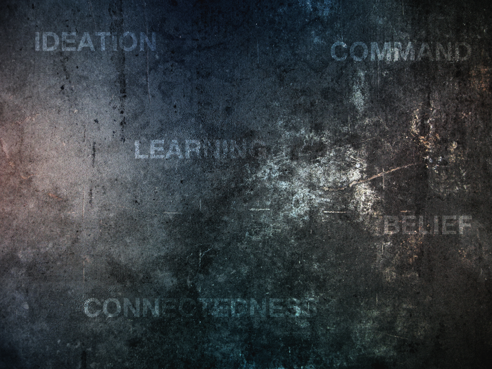

Hi, I’m Rheinard Korf and this is my **re-beginning**.  

For many years I have written numerous blogs, some long forgotten (farewell ’99), some a bit teen’ish and others wrapped up in corporate politics and now only discoverable via the “Wayback Machine”. Suffering from mild akrasia, I am now finally doing something I should have done a long time ago… a blog with my name!  

First post are often looked back upon with mild embarrassment and joy as you’ve seen your blog transform from those humble first few words. Knowing this, I am still going to post something that may seem profound now, but in time we can all laugh about – my introduction:

> Rheinard is a technology enthusiast and education aficionado with strengths in belief, ideation, learning, connectedness and command.

Stick around, it gets better. 😉

EDIT (2012): I did look at the “Wayback Machine”, but it was only able to take me as far back as 24 September 2001. Back then I wrote under a pseudo name, and I’ve had a little corner on the web since 1998. Presumably though, 24 September 2001 is my first recorded blog post on the Internet archives. (No, I won’t tell you my pseudo name or the link [that no longer exists] 😉)