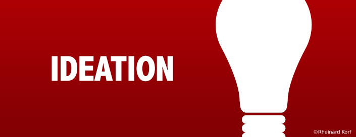

> People who are especially talented in the Ideation theme are fascinated by ideas. They are able to find connections between seemingly disparate phenomena.  

In my previous post I explained where these strengths have been identified (Strengths Finder 2.0 – Tom Rath). This is the 2nd of my Top 5, here are all of them in order: Belief, Ideation, Learning, Connectedness, Command.  

From my personal description of this strength, here are the phrases that resonates most with me:  

> * You embrace opportunities to be creative.
> * Instinctively, you derive great pleasure from making discoveries designing innovations.
> * Chances are good that you occasionally contrive innovative ideas.
> * You may spring from one original thought to an entirely different one.
> * By nature, you often experience satisfaction with your life when someone asks you to scrutinize, assess, examine, or evaluate things such as people, processes, plans, or mechanisms.

This has probably been the one strength that has received most of my dedicated time. I’ve been fortunate enough to be in roles that require me to come up with new ideas as well as look at systems for improvement. This has often translated into staff training opportunities and implementing new systems (sometimes a little prematurely).  

My current role in the workplace still holds true to this strength and allows me to continue working on it. The caveat of this strength is that occasionally I get the “mad scientist” picture applied to me – having hundreds of little experiments on the shelf in need of completion. Its a good thing I believe in comparative advantage: that I cannot complete everything myself and rely on the strength’s of others.  

My passion for ideation, education and technology has given me opportunities for public speaking and working on exciting projects.