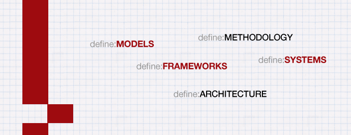

For the last little while I’ve been intrigued with taking lessons commonly taught in business programs and applying it to the field of e-learning. Having now worked in both a large training organisation (for 7 years) and a smaller local training organisation (19 months) it is fascinating to compare the different approaches and also seeing the difficulties in each case.  

This year I’ve also had the opportunity to look into several smaller training organisations (via a project) and have seen similar patterns as before in these organisations.  

For some of these organisation they are just getting started and my former employer was at the fringe of implementing new technologies. Regardless of which organisation I looked at, there is one common thread: no framework for implementing e-learning (though some frameworks do exist).  

At a recent conference I presented at, I did a brief comparison of implementation between the organisation I worked for and the one I work for. It was helpful as it painted the picture very clearly that each organisation’s approach is individual. Yet now I want to combine these experiences with other models and frameworks.  

So here is my approach:

## Starting Small

Next week I am a guest speaker at a networking event / AGM.  I am planning to focusing on some key observations taken from working in these different organisations and presenting a simple concept (mindset) for implementing e-learning programs in learning organisations. This will be extremely brief and I have Brad Beach (GippsTAFE) to thank for setting me down this track. The approach is focusing on best-practice classroom teaching and then asking the question: “how do we do this with technology?” – its straight forward, its achievable and is likely to have to most profound long term impact.

## Not so Small

I am also putting together a submission to present at an Australian / New Zealand conference. To be considered you have to present twice (this could be the same topic, but different days or completely different topics presented in parts). I’m opting for the latter.  

The idea here is to focus on taking management principles and applying it to the rollout of an e-learning strategy. From project team size, to communication, to operating environment to iteration (give or take a few steps).  

Following on from using management principles, I want to look at e-learning implementation as a framework – identifying all the core processes that make e-learning programs work.  

The 2-day presentation platform will really allow me to set the scene for introducing e-learning models, methodologies, architecture (design/construction), frameworks and systems.  

It is going to be a lot of hard work to start synthesising some business concepts into e-learning processes, but I do feel that learning organisations have so much potential that are not often seized and some sort of toolkit would benefit everyone.

### Disclaimer

I am not an academic. I can’t possibly tell you where the various things that I have learned over the last 8 and a half years working with e-learning come from. But I can tell you how I’ve acquired it:  

* Blogs: Reading an enormous amount of blogs varying from technology, entertainment, learning
* Podcasts: Predominantly tech podcasts
* Audio Books: Lots and lots of audio books ranging from business to self-help to personal productivity to marketing to fiction.
* Conferences: I’ve been presenting at conferences now since 2005. Not only is it good for networking, but the very act of preparing a presentation helps you solidify your learning, or even come up with new ideas.

It is impossible to take the sum of all of what I learnt and experiences and give appropriated references. So to the real disclaimer part, I will present concepts that work in the business world, but may not have previously been tested with e-learning. This means that I will make mistakes and sometimes even just with a slip of the mind I may step on some toes. I apologise. I also don’t claim to know everything, I have a pretty good instinct and sometimes that’s what I follow, without the scientific research to back me up. 

That said, I will reference as far as possible.

Here’s to mental models!